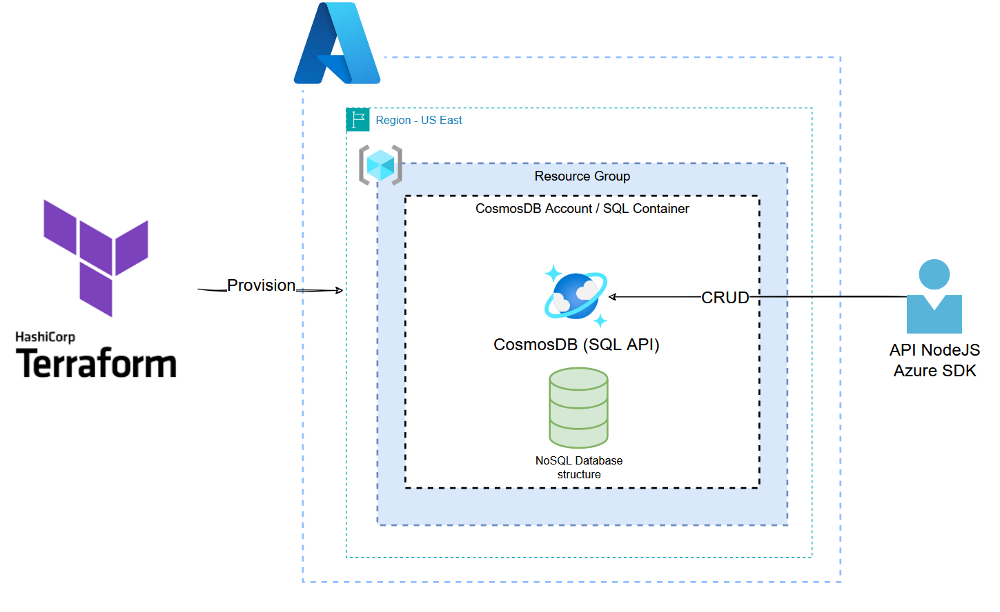

# CosmosDB CRUD Project



This repository contains all the necessary code to set up an Azure Cosmos DB with SQL API using Terraform, along with a Node.js application (written in TypeScript) that connects to Cosmos DB and performs CRUD (Create, Read, Update, Delete) operations.

## Project Structure

├── infra/                          # Terraform infrastructure code
│   ├── main.tf                     # Main Terraform configuration
│   ├── variables.tf                # Terraform variables
│   └── outputs.tf                  # Outputs for provisioned resources
└── app/                            # Node.js CRUD application
    ├── src/
    │   ├── repository/
    │   |   └── enitity/            # Database entities folder
    │   ├── routes/
    |   |   └── item.route.ts       # Cosmos DB configuration Service and Routes configuration
    │   └── services/
    │       ├── enitity/            # DTO entities folder
    │       └── cosmosdb.service.ts # CosmosDB Service
    ├── index.ts                    # Main application file
    ├── package.json                # Node.js dependencies and scripts
    ├── tsconfig.json               # TypeScript configuration
    └── REST.http                   # HTTP requests file

## Prerequisites

- **Azure CLI**: To authenticate and manage Azure resources.
- **Terraform**: To provision Cosmos DB resources on Azure.
- **Node.js**: Version 14 or higher, along with npm, for running the Node.js application.
- **TypeScript**: Installed via npm as part of the application setup.

## Getting Started

### 1. Provisioning Cosmos DB on Azure

The `infra` folder contains Terraform files to set up an Azure Cosmos DB with SQL API.

1. **Navigate to the `infra` directory**:
   ```bash
    cd infra
   ```

2. Initialize Terraform:
    ```bash
    terraform init
    ```

    Set up required variables: Adjust the variables.tf file to define values like the resource group name and Cosmos DB account name. You can also provide these values when running Terraform commands.

3. Deploy resources:
    ```bash
    terraform apply
    ```

    After deployment, Terraform outputs the Cosmos DB connection details for use in the application.

### 2. Setting Up the Node.js Application

The app folder contains a TypeScript Node.js application that connects to the Cosmos DB and performs CRUD operations.

1. Navigate to the app directory:
    ```bash
    cd ../app
    ```

2. Install dependencies:
    ```bash
    npm install
    ```

3. Configure Cosmos DB connection:

    In clone .env from .env.example, set up your Cosmos DB connection Endpoint URL, Cosmos DB Key, database name, and container name. Use the connection details output by Terraform.

4. Run the application in development mode with TypeScript watcher:
    ```bash
    npm run dev
    ```

The application should now be connected to Cosmos DB and capable of performing CRUD operations. You can test these operations by sending HTTP requests to the app. For this use can find an .http file within ./app/REST.http to test the application.

### 3. CRUD Operations

The Node.js application implements basic CRUD operations with Cosmos DB, found in src/services/cosmosdb.service.ts:

    - createOneItemOnDatabase: Add new documents.
    - selectFromDatabaseAllItems: Retrieve all documents from database.
    - selectFromDatabaseById: Retrieve one document by id.
    - selectFromDatabaseByCategoryName: Retrieve one document by category name (paritionKey in this case).
    - updateItemOnDatabase: Modify existing documents.
    - deleteOneItemOnDatabase: Remove documents by ID.

Notes

    - Terraform State: Ensure your Terraform state file is managed securely, especially for production deployments.
    Environment Variables: Use environment variables for sensitive Cosmos DB configurations rather than hardcoding values.

## Contributing

Contributions are welcome! Please open issues or submit pull requests to help improve the project.
License

This project is licensed under the MIT License. See the LICENSE file for details.

This `README.md` file provides all the essential information for setting up, configuring, and running your Cosmos DB infrastructure and Node.js application, making it easy for others to get started with your project.
